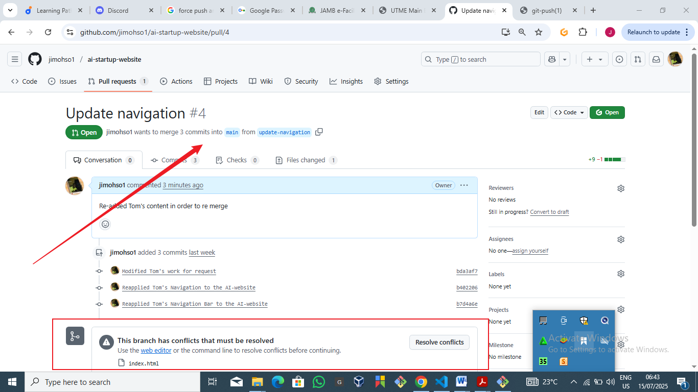

# ai-startup-website
Mini Project-Basic Git Commands 
# Part 1 : Setup and Initial Configuration
## 1. Installed Git:

## 2. Created GitHub Repository

## 3. Cloned Repository

# Part 2: Simulating Tom and Jerry's Work

## 1. Tom's Work Simulation

### * Navigated To Directory

### * Branch Checked

### * Tom's branch was created and switched;

### * Content added:

### * Added: git add index.html

### * Status: git status

### * Commit: git commit -m "Update navigation bar"

### * Push:git push origin update-navigation

### * Pulled: git pull origin update-navigation
 

## 2. Jerry's Work Simulation

### * Jerry's Branch Created: git checkout -b add-contact-info

### * Index.html

### * git add index.html

### * git commit -m "Add contact information"

### * git push origin add-contact-info

# Part 3: Merging Changes

## 1. Navigated to GitHub Repository:

## 2. Switched to The Tom's Branch: 

## 3. Created a New Pull Request: 

## 4. Review Tom's Changes: 

## 5. Created New Pull Request:

## Reviewing And Merging Tom's Pull Request

## 6. Switched To Jerry's Branch:

## 7. Created a New Request:

## 8. Review Jerry's Changes:

## 9. Created New Pull Request:

## Reviewing And Merging Jerry's Pull Request
### Merged

